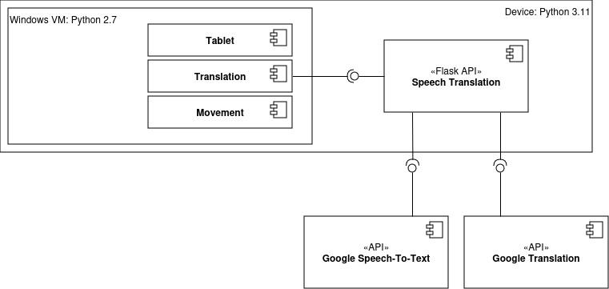
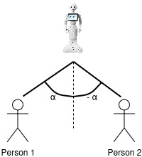
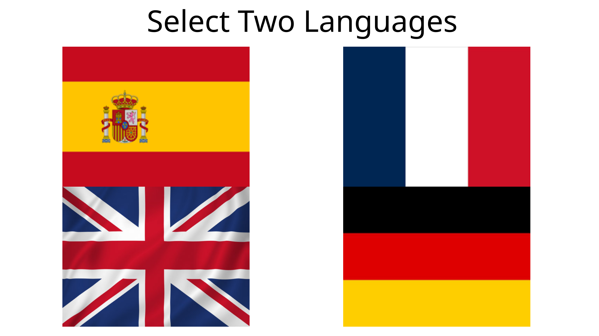
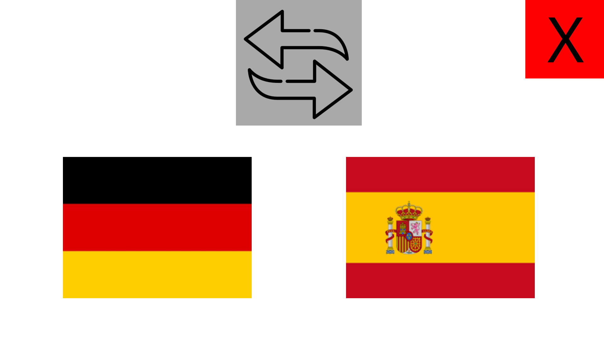
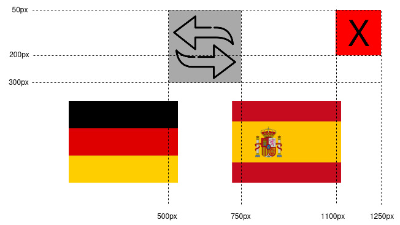

# Dokumentation BablePal
## Technischer Aufbau

Die selber implementierte Funkionalität vom BabelPal ist aufgeteilt in zwei verschiedene Laufzeitumgebungen.
Auf einer VM ist die spezifische Python Version 2.7 installiert, die Pepper voraussetzt. Darauf sind alle Features rund um Pepper implementiert. Die Bewegungen für das Nicken, das Anschauen der Personen, die animierte Sprache und die Steuerung vom Tablet.
Auf einer weiteren Umgebung ist die Funktionalität vom Speech-To-Text und die Übersetzung implementiert. Diese wird über eine API zur Verfügung gestellt. 
Dieser Aufbau wurde gewählt, um für die Sprache- und Übersetzungsfunktionalität unabhängig von der Python-Version 2.7 sein zu können. 

## Speech Translation API
This API provides endpoints to start a speech-to-text conversion via the internal microphone and receive a translated text once the stop endpoint is called. See OpenAPI specification [here](swagger.yaml)

### /start

#### GET
##### Summary:

Start the recording for speech-to-text

##### Parameters

| Name | Located in | Description | Required | Schema |
| ---- | ---------- | ----------- | -------- | ---- |
| language | query | Language which is spoken | Yes | string |

##### Responses

| Code | Description |
| ---- | ----------- |
| 200 | Successfully started the speech-to-text |

### /stop

#### GET
##### Summary:

Stop the speech-to-text and return the text translated into the provided language

##### Parameters

| Name | Located in | Description | Required | Schema |
| ---- | ---------- | ----------- | -------- | ---- |
| language | query | Language the recorded text should be translated into | Yes | string |

##### Responses

| Code | Description |
| ---- | ----------- |
| 200 | successful stop and translated |

## Umsetzung Mimik und Gestik
Damit Pepper während dem Sprechen die richtige Person anschaut wurde folgender Ablauf implementiert:
1. Beim Start von einem Satz berührt man den Kopf von Pepper
2. Beginnt man dann zu sprechen, versucht Pepper über die API **ALSoundLocalization** den Standort der Person auszumachen. 
3. Die erste erhaltene Position wird fixiert und wir lassen Pepper in diese Richtung schauen. 
4. Beended die erste Person seinen Sprach-Input über eine weitere Kopfberührung, lassen wir Pepper im selben Winkel in die entgegengesetzte Richtung blicken.  
 
#### Abgrenzung  
Dies basiert auf der Annahme, dass sich jeweils zwei Personen unterhalten und diese zusammen mit Pepper in einem Dreieck aufgestellt haben. 

## Umsetzung Tablet Interaktionen
Für die Umsetzung der Tablet Inputs wurde eine Pixelbasierete Variante gewählt. Das heisst, zu Beginn haben wir für jeden möglichen Screen ein passendes Bild erstellt.   

Einmal für die Startauswahl:  
  
   
Und jeweils für jede Sprachkombination, zum Beispiel Deutsch --> Spanisch:
 

 Danach wird über die Koordinaten X / Y festgelegt, ob eine Fläche berührt worden ist oder nicht:
  

Die einzelnen Randpunkte für die Flächen können jeweils über eine Berührung ausgelesen werden und danach fix codiert werden. Dieser Ansatz ist sehr simple und funktioniert für solche wenigen Inputs gut. Steigt jedoch die Komplexität muss dieser Ansatz überdenkt werden.