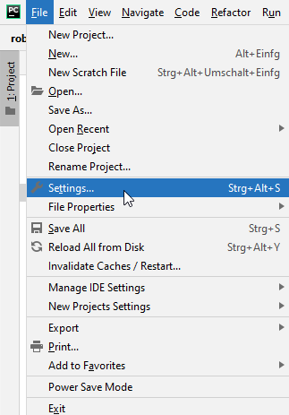
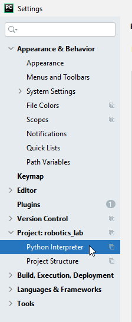
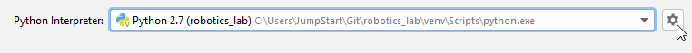
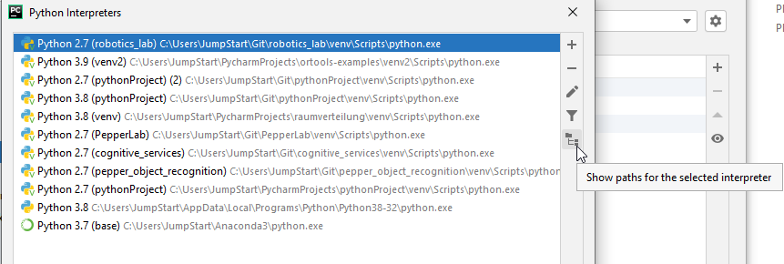
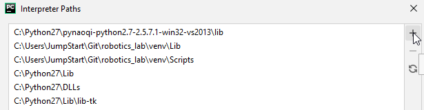

# Setup your Pycharm Project

1. Download this repository.

1. Open PyCharm and open the downloaded repository by clicking on `File > Open...` . Choose the downloaded folder.

1. Set the python interpreter to **Python 2.7**. Click on `File > Settings` 

   
   
   chose `Python Interpreter` on the left
   
   
   
   and add a new Virtualenv Environment with the Python 2.7 interpreter by clicking first on the gearwheel and choose `Add..`.
   
   
   
   Select the **Python 2.7** as the base interpreter and click OK.
   
1. Next, as well under `Python Interpreter`, set an additional **interpreter path** by clicking on the gearwheel again, chose`Show all..`.

   

1. Select your Interpreter and click on the right `Show paths of selected interpreter`
  
1. Add the path by clicking on the `+` button and set the 
`/path_to_your_naoqi_python_package/lib`.

   

