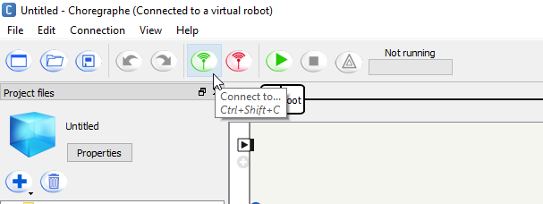
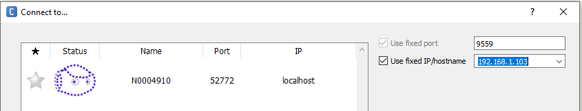
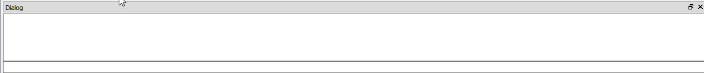

# Programming Pepper

This repository contains
1. [Installation instructions](#installation)
1. [A python wrapper for NaoQi](#the-naoqi-wrapper)
1. [General instructions - real robot](#working-with-the-real-robot)
1. [General instructions - simulated robot](#working-with-a-simulated-robot)
1. [Sample codes](examples) and 
1. [Exercises](exercises/README.md)

## Installation

1.  If you use MacOs or Linux, it is highly recommended to use the VM. If your host operating system is Windows, you can locally install all software or use the VM provided on ILIAS. The VM contains all software components.

1. Skip the following steps if you use the VM. If you want to install the software locally, follow the instructions:

    1. Install **Python 2.7.13 - 32 bits** from [the official website](https://www.python.org/download).

    1. Download the right version of Pepper Python SDK **NaoQi 2.5** for your operating system:

        - [Windows](https://www.aldebaran.com/fr/support/pepper-naoqi-2-9/downloads-softwares)
        - [MacOs - not recommended](https://www.aldebaran.com/fr/support/pepper-naoqi-2-9/downloads-softwares): supported version Mac Os X 10.11 El Capitan. The naoqi library does not work with newer versions of Mac Os!
        - [Linux - not recommended](https://www.aldebaran.com/fr/support/pepper-naoqi-2-9/downloads-softwares): supported version Ubuntu 14.04 64 bit only
    
        *Note*: Newer versions of NaoQi do not work with our Pepper platform.
   
    1. Install **Choregraphe** from the same site as well.

    1. Install the Python IDE [PyCharm](https://www.jetbrains.com/de-de/pycharm/download/).

    1. Chose **Python 2.7 - 32 bits** as your interpreter and add the `path_to_your_pynaoqi/lib` path to your interpreter. If you use Pycharm, you can follow the instructions in the [SetupPycharm.md](documentation/SetupPycharm.md).


## The NaoQi Wrapper

Using the module [naoqi_python_wrapper](naoqi_python_wrapper) allows you to benefit from autocompletion and docstrings in
your favorite IDE. The wrapper is based on [pynaoqi_mate](https://github.com/uts-magic-lab/pynaoqi_mate) and was adapted
to work with pynaoqi 2.5 and our two pepper robots "Pale" and "Ale".

## Working with the Real Robot

Please watch this video before starting to work with the Pepper robot:

[](http://www.youtube.com/watch?v=pH6Wic78kD8 "Pepper Hardware")


Pepper connects automatically to the wlan `robo`. To communicate with Pepper, your computer needs to connect to the same network. The password is `willowgarage`.
Once connected, chose the right robot in your python code:

```python
from pepper_robots import Robot, PepperConfiguration, PepperNames

robot = Robot(PepperConfiguration(PepperNames.Pale))
robot = Robot(PepperConfiguration(PepperNames.Ale))
```

This automatically sets the right IP addresses (Pale: `192.168.1.103`, Ale: `192.168.1.180`)

If you are in the same wireless network as Amber, run the `test_run.py` (or modify `test_run.py` to work with another robot).

I highly recommend that you disable the "Autonomous Life" of Pepper. This service may interfere with your program. To do so, initialize your robot like this:

`robot = Robot(config, reset=True)`

or include something like this in your program

```python
if robot.ALAutonomousLife.getState() != "disabled":
    robot.ALAutonomousLife.setState("disabled")
    robot.ALRobotPosture.goToPosture("StandInit", 0.5)

```

The documentation for NaoQi 2.5 can be found [here](http://doc.aldebaran.com/2-5/home_pepper.html).

## Working with a Simulated Robot

*Please note that the simulated robot does not provide all functionalities. For example, one can not use the video capture or the speech recognition APIs.*

Start Choregraphe and click on the "connect" button:



A new window will pop up that shows the port to the simulated robot:

.

This simulated robot can now be used in Python:

 ```python
from pepper_robots import Robot, PepperConfiguration, PepperNames
robot = Robot(PepperConfiguration(PepperNames.Simulation, port=52772))
```

The `test_run.py` should also work with the simulated robot. Have a look at the Robot and Dialog view in Choregraphe:




